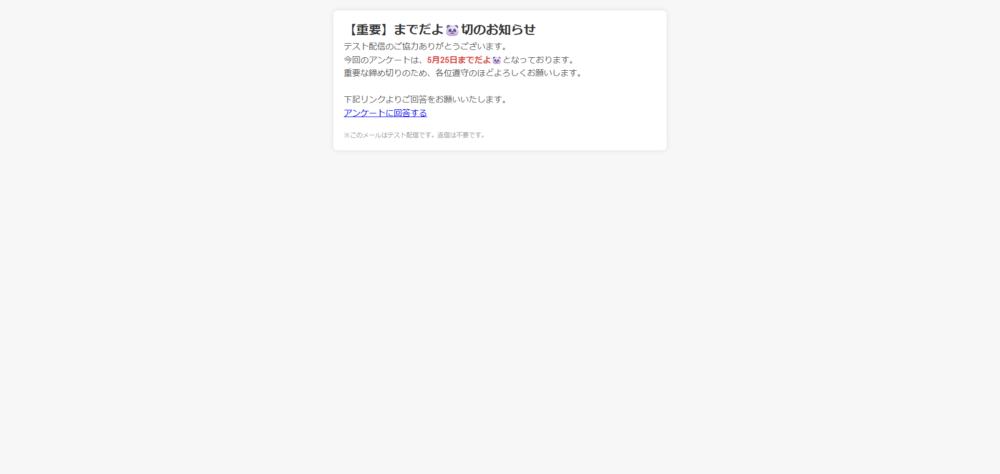

# LetterChanger

LetterChanger は、特定の文字列を置換するChromeの拡張機能です。

## 概要

この拡張機能は、ウェブページ上の特定の文字列（例：「〆」）を、より親しみやすい表現（例：「までだよ🐼」）に自動的に置換します。

## 特徴

- 指定した文字列の自動置換機能
- オン/オフの切り替えが可能なポップアップインターフェース

## スクリーンショット
以下は、拡張機能のスクリーンショットです。


## インストール方法

1. このリポジトリをクローンまたはダウンロードします。

```bash
   git clone https://github.com/RaccoonDog256/LetterChanger.git
````  


2. Google Chrome を開き、`chrome://extensions/` にアクセスします。

3. 右上の「デベロッパーモード」を有効にします。

4. 「パッケージ化されていない拡張機能を読み込む」をクリックし、ダウンロードしたフォルダを選択します。

## 使用方法

1. 拡張機能をインストール後、ブラウザのツールバーに表示されるアイコンをクリックします。

2. (一部webページのみ)拡張機能をクリックします。

3. 機能がオンの状態で、対象の文字列が含まれるウェブページを閲覧すると、自動的に指定された表現に置換されます。

## 開発者向け情報

* **言語**: JavaScript, HTML, CSS
* **ファイル構成**:

  * `manifest.json`: 拡張機能の設定ファイル
  * `content.js`: ページ内容のスクリプト
  * `popup.html` / `popup.js`: ポップアップインターフェース
  * `icon*.png`: 拡張機能のアイコン